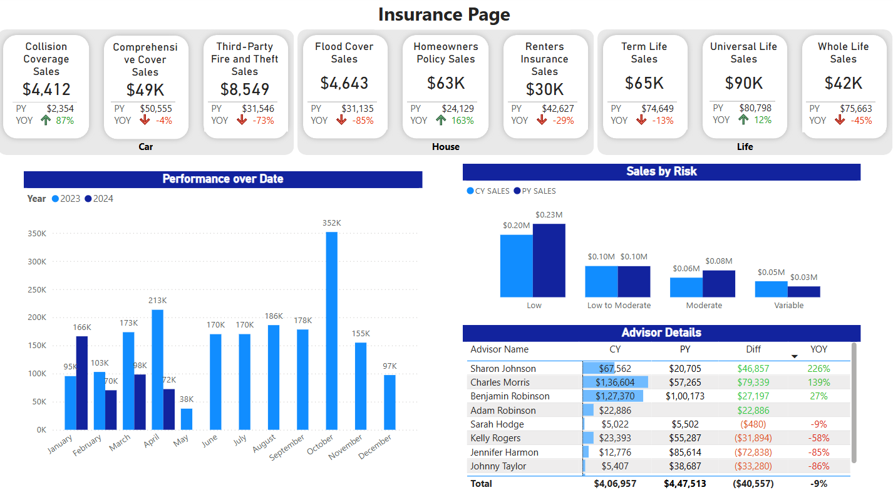
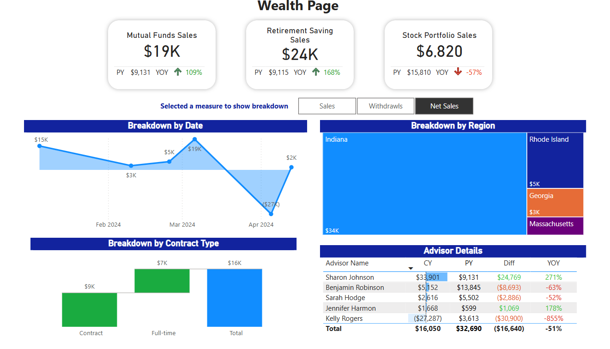
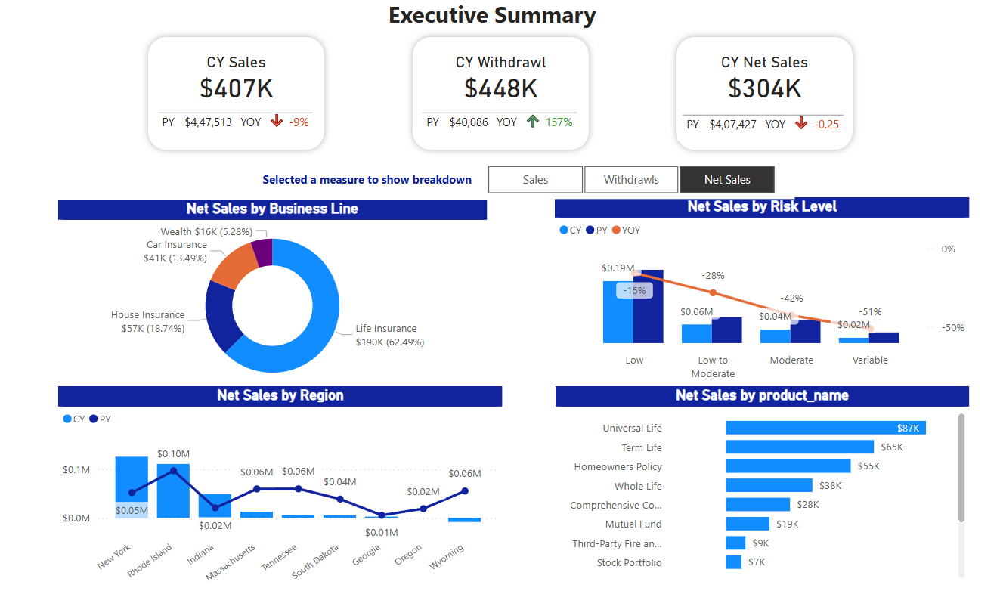

# 📊 CityLife 360° Power BI Dashboard
#### *A Data-Driven Approach to Advisor & Product Performance Analysis*

--- 

## 🎯 Project Overview  
This project provides a **comprehensive analysis of insurance and wealth management sales**, focusing on **advisor performance, product sales trends, risk levels, withdrawals and regional distribution**. The dashboard is built in **Power BI**, using interactive visualizations to help stakeholders make data-driven decisions.  

## 📁 Dataset Overview  
The dataset consists of **three primary raw data sheets**:  

### **1️⃣ OS Sales Sheet**  
- Contains **all sales transactions** across **insurance** and **wealth management** products.  
- Includes **sales amount, withdrawals, contract type and region**.  
- Tracks **time-based metrics** (year, month) for trend analysis.  

### **2️⃣ Product Sheet**  
- List of all **insurance and wealth products** with detailed attributes.  
- Categorized into **Insurance (Car, House, Life)** and **Wealth Products (Mutual Funds, Retirement, Stocks)**.  
- Includes **risk level classification** (Low, Moderate, High, Variable).  

### **3️⃣ Advisor Sheet**  
- Contains information about **advisors handling sales transactions**.  
- Includes **advisor ID, name, assigned region, and performance metrics**.  
- Used for analyzing **individual advisor contributions** to sales and withdrawals.  

---

## 📊 Dashboard Structure & Features  

### **1️⃣ Insurance Sales Page**  
📌 **Total Sales & Year-over-Year (YoY) Growth** for insurance products**.  
📌 **Breakdown by Risk Level** (Low, Moderate, Variable)**.  
📌 **Withdrawals vs. New Sales** trend analysis**.  
📌 **Top Performing Advisors in Insurance Sales**.  
📌 **State-wise sales performance** across different regions**.  

---

### **2️⃣ Wealth Management Sales Page**  
📌 **Total Sales & Withdrawals Breakdown by Wealth Product Type**.  
📌 **Net Sales Calculation for Different Wealth Categories**.  
📌 **Advisor Performance in Wealth Management Sales**.    
📌 **Yearly Trend of Wealth Withdrawals & Net Contributions**. 

🔍 **Tile Selection Slicer Used:**  
✅ **Sales** – Displays total wealth management sales.  
✅ **Net Sales** – Shows total sales after accounting for withdrawals.  
✅ **Withdrawals** – Highlights the impact of withdrawals on financial performance.  

---

### **3️⃣ Executive Summary Page**  
📌 **Total Revenue, Withdrawals, and Net Sales across all business lines**.   
📌 **Sales & Net Contributionby Risk level**.  
📌 **Top-Performing Insurance & Wealth Products**.  
📌 **State-Wise Sales Performance Analysis**.  

🔍 **Tile Selection Slicer Used:**  
✅ **Sales** – Displays overall sales revenue.  
✅ **Net Sales** – Highlights sales after adjusting for withdrawals.  
✅ **Withdrawals** – Shows withdrawal trends across all business lines.  

---

## 📸 Dashboard Screenshot  
**Insurance Sales Page**  

**Wealth Management Sales Page**  

**Executive Summary Page**  

 

---

## 🚀 Tools & Technologies Used  
- **Power BI** (Data Visualization & Dashboarding)  
- **DAX (Data Analysis Expressions)** for calculated measures & KPIs  
- **Power Query** for Data Cleaning & Transformation  
- **Excel** for preliminary data exploration  

---

## 📌 How to View the Dashboard  
1. Download the **`Insurance_Wealth_Sales_Dashboard.pbix`** file.  
2. Open it in **Power BI Desktop**.  
3. Navigate through different pages (**Insurance, Wealth, and Executive Summary**) to explore insights.  
4. Use **tile selection slicers** on the **Wealth & Executive Summary** pages to filter data dynamically.  

---

## 🛠️ Data Analysis Process  

### **1️⃣ Data Cleaning & Preparation**  
✔ Removed **duplicate & missing records**.  
✔ Standardized **date formats** for consistency.  
✔ Created **calculated columns** for **YoY Growth, Net Sales, and Risk Levels**.  
✔ Merged **OS Sales, Product, and Advisor datasets** for a unified view.  

### **2️⃣ Exploratory Data Analysis (EDA)**  
✔ Identified **top-selling insurance & wealth products**.  
✔ Analyzed **regional sales performance** and market trends.  
✔ Evaluated **advisor performance & efficiency gaps**.  
✔ Compared **withdrawals vs. net sales trends**.  

### **3️⃣ Visualization & Dashboard Creation**  
✔ Designed **interactive dashboards** in **Power BI** with dynamic visualizations.  
✔ Used **bar charts, treemaps, and KPI cards** to highlight key business metrics.  
✔ Built a **high-level executive summary** for decision-makers.  

---

## 📊 **Key Business Insights**  
✅ **Life Insurance & Mutual Funds** are the **top-selling products**.  
✅ **Withdrawals have increased significantly**, impacting net sales.  
✅ **High-risk insurance plans** contribute to **lower sales growth**.  
✅ **New York & Indiana** lead in sales, while some states show **declining performance**.  
✅ **Some advisors consistently outperform others**, highlighting gaps in sales strategies.  

---

